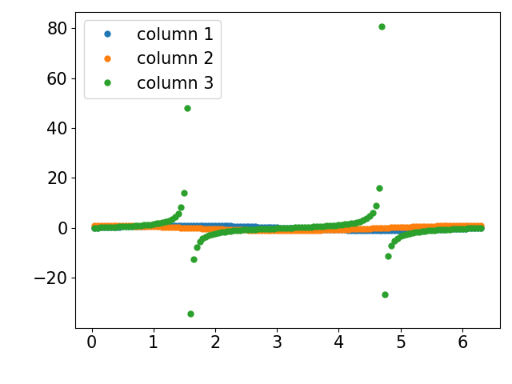
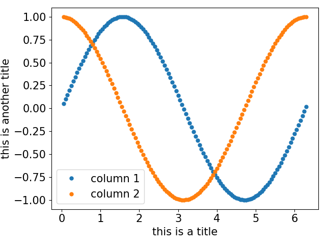
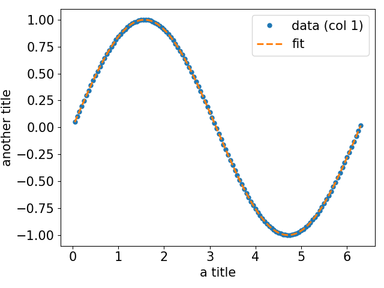

# PlaFi
PlaFi (**pl**otter **a**nd **fi**tter) is an application that allows to quickly plot and fit some data. It has been
designed to be used during data taking sessions, in order to have a quick display of simple data, and to confirm or not 
a certain behaviour.

## Installation
The application can be installed by cloning the repository [plafi](https://github.com/giggi22/plafi) and using pip:
```
git clone https://github.com/giggi22/plafi
pip install --editable plafi
```

## Usage
When installed, PlaFi can be called from command line using `plafi <subcommand>`. A help message will appear by typing
`plafi -h`. Here are the main commands:

### Plotting
In order to plot some data, the command 
```
plafi plot <path_to_file>
```
can be used. The file must be of type _.txt_, _.xlsx_ or _.csv_ (with ';' as separator). Every column will be plotted as
function of the first one. In case of **headings** in the file, the flag `-v` must be used.


In order to select a specific column to plot, the command 
```
plafi plot -v
```
can be used. It will ask the user for the path, the number of rows to skip (can be used to skip the headings), the 
columns to use for the plotting and the axis labels.

#### Example
Here there is an example of the `plot` option:
```
plafi plot <path_to_plafi>/examples/example1.xlsx
```
The output will be: <br/>
# </img>


Here there is an example of the `plot -v` option:
```
plafi plot -v
               
Path to data to plot: <path_to_plafi>/examples/example1.xlsx
Number of rows to skip: 0
Index of x data: 0
Indexes of y data: 1 2
X axis title: this is a title
Y axis title: this is another title

```
The output will be: <br/>
# </img>

### Fitting
In order to fit some data, the following command can be used:
```
plafi fit <path_to_configuration_file>
```
The configuration file can be created in the current working directory by using the command `plafi fit -c`. It can be
modified (as if it were a _.txt_ file) with all the parameters needed for the fitting procedure. <br/>
Here there is an example of a configuration file:
```
[fitting parameters]
path = <path_to_plafi>/examples/example1.xlsx
rows to skip = 0
x data index = 0
y data index = 1
number fitting parameters = 3
fitting function = var1*cos(x+pi*var2)+T-var3 
x-axis title = a title
y-axis title = another title
```
Another possibility is to insert all the parameters in the command line using the command`plafi fit -v`.
At the user will be asked the file path, the number of rows to skip (can be used to skip headings), the columns to use
for the fitting procedure, the number of fitting parameters and the axis labels. Then, the data and the fitting function
will be plotted and the fitting parameters will be printed.

#### Example
Here there is an example of the `fit -v` option:
```
plafi fit -v

Path to data to plot: <path_to_plafi>/examples/example1.xlsx     
Number of rows to skip: 0                      
Index of x data: 0
Index of y data: 1
Number of fitting parameters (max 5): 3                     
Write the fitting function. Use var1 var2 var3 as fitting parameters.
>>> var1*cos(x+pi*var2)+T-var3 
X axis title: a title
Y axis title: another title
```
where `pi` and `T` are [constants](#constants)<br/>
And the output:
```
parameter 1:  0.99999999999956+/-0.00000000000004
parameter 2:  1.499999999999994+/-0.000000000000013
parameter 3:  300.000000000000000+/-0.000000000000028
```
# </img>

### Constants
Constants can be used when writing the fitting formula. <br/>
The constants that are included in the numpy library (`e`, `pi` or `euler_gamma`) are initialized with the constants file.
In order to visualize the actual constants the following command can be used:
```
plafi const
```
In order to create a new constant, the flag `-a` must be added. The flag `-d` can be used to delete an existing constant.
Here an example:
```
plafi const

╒════════╤═════════╕
│ name   │   value │
╞════════╪═════════╡
│ T      │     300 │
╘════════╧═════════╛
```
```
plafi const -a

New constant name: k
New constant value: 3.45
╒════════╤═════════╕
│ name   │   value │
╞════════╪═════════╡
│ T      │  300    │
├────────┼─────────┤
│ k      │    3.45 │
╘════════╧═════════╛
```